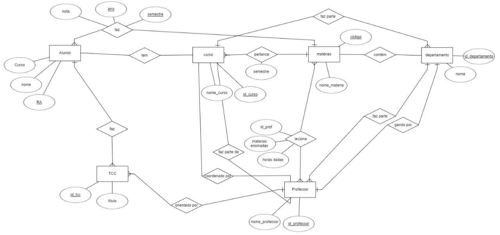
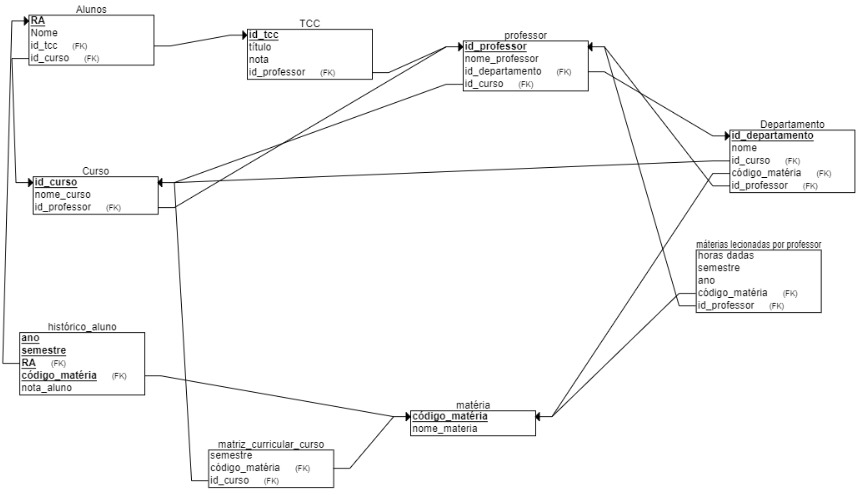

# Projeto_bancoDeDados
Projeto de Banco de Dados para uma universidade: 
O objetivo deste projeto é implementar um sistema de banco de dados para uma universidade. O sistema deve ser capaz de armazenar e gerenciar informações relacionadas a alunos, professores, departamentos, cursos, disciplinas, históricos escolares de alunos, histórico de disciplinas lecionadas por professores, TCCs apresentados considerando tanto o grupo de alunos como o professor orientador.

Integrantes:
-Beatriz Manaia Lourenço Berto RA: 22.125.060-8
-Laura de Souza Parente RA:22.123.033-7

# Como executar o projeto:
-abre o supabase (https://supabase.com/)e em "SQL Editor" coloque a DDL abaixo, emseguida clique em "run"

-após rodar a primeira DDL, no supabase, em "SQL editor" rode a segunda que está logo abxio para fazer o relacionamento de id departamento na tabela professor 

-no replit coloque o código commitado nesse projeto para inserir os dados na tabela, antes de rodar, coloque sua supabaseUrl e supabaseKey no código 

-execute as queries abaixo para verificar o funcionamento do projeto

##  Modelo Entidade Relacionamento:


## Modelo Relacional na 3FN:


## DDL usado para a criação das tabelas necessárias:

```sql

-- Apagar todas as tabelas considerando dependências
drop table if exists historico_aluno cascade;
drop table if exists matriz_curricular_curso cascade;
drop table if exists materias_lecionadas_por_professor cascade;
drop table if exists departamento cascade;
drop table if exists materias cascade;
drop table if exists alunos cascade;
drop table if exists tcc cascade;
drop table if exists professor cascade;
drop table if exists curso cascade;

--criar tabelas
create table curso
    (id_curso	text, 
    nome_curso	text, 
    primary key (id_curso)
    );

 create table professor
  (nome_professor text,
  id_professor integer,
 -- id_departamento serial not null,
  primary key(id_professor)
  --foreign key (id_departamento) references departamento (id_departamento)
  );
  
  create table tcc
    (id_tcc serial not null, 
    titulo text,
  id_professor integer,
  nota float,
    primary key (id_tcc),
  foreign key (id_professor) references professor (id_professor)
    );

create table alunos
    (ra		text,
     nome		text,
   id_curso text, --coluna tem q existir p chave estrangeira aponta
   id_tcc	integer,
     primary key (ra),
   foreign key (id_curso) references curso (id_curso),
   foreign key (id_tcc) references tcc (id_tcc)
    );

create table materias
  (nome_materia text,
   codigo_materia text,
   primary key (codigo_materia)
  );

create table departamento 
  (nome text,
   id_departamento serial not null,
   id_curso text, 
   codigo_materia text,
   id_professor integer,
   primary key(id_departamento),
   foreign key (id_curso) references curso (id_curso),
   foreign key (codigo_materia) references materias (codigo_materia),
   foreign key (id_professor) references professor (id_professor)
  );

create table materias_lecionadas_por_professor
  (horas_dadas float,
   semestre int,
   ano int,
   codigo_materia text,
   id_professor integer,
  foreign key (codigo_materia) references materias (codigo_materia),
  foreign key (id_professor) references professor (id_professor)
  );

create table matriz_curricular_curso
  (semestre int,
   codigo_materia text,
   id_curso	text,
   foreign key (codigo_materia) references materias (codigo_materia),
   foreign key (id_curso) references curso (id_curso)
  );

create table historico_aluno
  (nota_aluno float,
   semestre int,
   ra	text,
   ano integer ,
   codigo_materia text,
   primary key(semestre, ra,ano,codigo_materia),
   foreign key (ra) references alunos (ra),
   foreign key (codigo_materia) references materias (codigo_materia)
  );
  
```

## DDL para fazer relacionamento entra tabela "departamento" e tabela "professor"7

```sql 
--mudar tabelas adicionando FKs

ALTER TABLE curso 
ADD COLUMN id_professor INTEGER REFERENCES professor(id_professor);

ALTER TABLE professor
ADD COLUMN id_departamento INTEGER NOT NULL REFERENCES departamento(id_departamento),
ADD COLUMN id_curso TEXT  REFERENCES curso(id_curso);

-- Inserir curso
insert into curso (id_curso, nome_curso, id_professor)
values ('CC35473', 'Ciência da Computação', NULL);


-- Inserir os departamentos
insert into departamento (id_departamento, nome)
values 
  (1, 'Matemática'),
  (2, 'Ciência da Computação'),
  (3, 'Física'),
  (4, 'Engenharia Elétrica'),
  (5, 'Engenharia Civil'),
  (6, 'Engenharia de Produção'),
  (7, 'Administraçãoo'),
  (8, 'Ciência Social e Jurídica'),
  (9, 'Engenharia Mecânica'),
  (10, 'Engenharia Química');


-- inserir o professor para conseguir adicionar professor aleatorios com codigo sem impactar dependencia entre professor e departamento
insert into professor (id_professor, nome_professor, id_departamento, id_curso)
values (0, 'Default', 1, 'CC35473');

```


