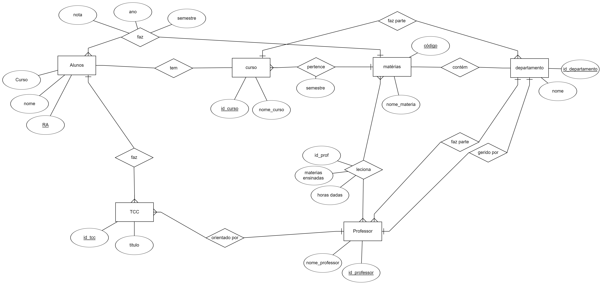
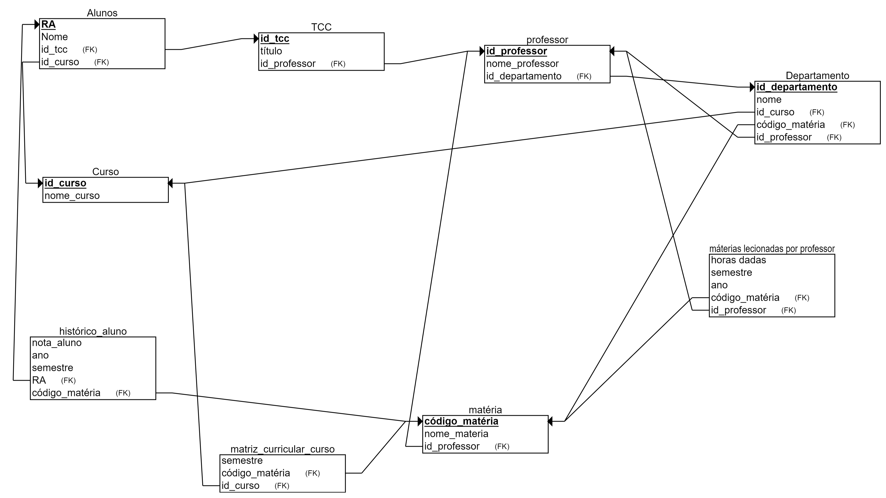

# Projeto_bancoDeDados
Projeto realizado em dupla com @laaurap na matéria de banco de dados 

##  Modelo Entidade Relacionamento:

## Modelo Relacional na 3FN:

## DDL usado para a criação das tabelas necessárias:

  create table curso
	(id_curso		numeric(11,0), 
	nome_curso	text, 
	primary key (id_curso)
	);

 create table professor
  (nome_professor text,
  id_professor numeric(11,0),
  primary key(id_professor)
  --foreign key (id_departamento) references departamento (id_departamento)
  );

  create table tcc
	(id_tcc	numeric(11,0), 
	titulo text,
  id_professor numeric(11,0),
	primary key (id_tcc),
  foreign key (id_professor) references professor (id_professor)
	);

create table alunos
	(ra		text,
	 nome		text,
   hora_complementar float,
   id_curso		numeric(11,0), --coluna tem q existir p chave estrangeira aponta
   id_tcc	numeric(11,0),
	 primary key (ra),
   foreign key (id_curso) references curso (id_curso),
   foreign key (id_tcc) references tcc (id_tcc)
	);

  
create table materias
  (nome_materia text,
   codigo_materia text,
   id_professor numeric(11,0),
   primary key (codigo_materia),
  foreign key (id_professor) references professor (id_professor)
  );

create table departamento 
  (nome text,
   id_departamento numeric(11,0),
   id_curso	numeric(11,0), 
   codigo_materia text,
   id_professor numeric(11,0),
   primary key(id_departamento),
   foreign key (id_curso) references curso (id_curso),
   foreign key (codigo_materia) references materias (codigo_materia),
   foreign key (id_professor) references professor (id_professor)
  );

create table materias_lecionadas_por_professor
  (horas_dadas float,
   semestre int,
   ano int,
   codigo_materia text,
   id_professor numeric(11,0),
   primary key (codigo_materia),
  foreign key (id_professor) references professor (id_professor)
  );

create table matriz_curricular_curso
  (semestre int,
   codigo_materia text,
   id_curso	numeric(11,0),
   foreign key (codigo_materia) references materias (codigo_materia),
   foreign key (id_curso) references curso (id_curso)
  );

create table historico_aluno
  (nota_aluno float,
   semestre int,
   ra	text,
   codigo_materia text,
   foreign key (ra) references alunos (ra),
   foreign key (codigo_materia) references materias (codigo_materia)
  );
